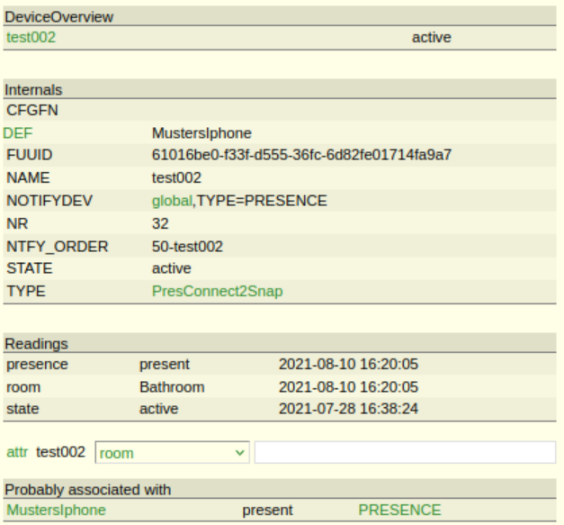
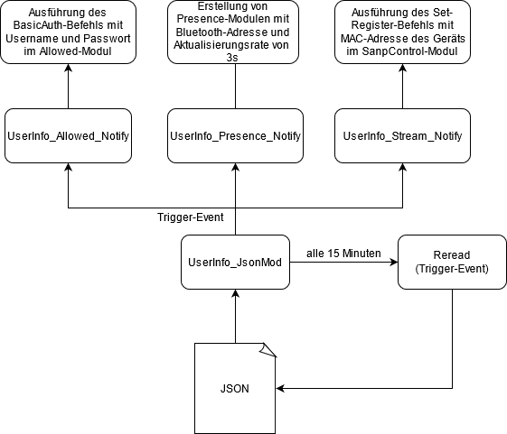
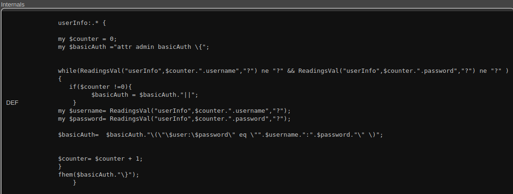
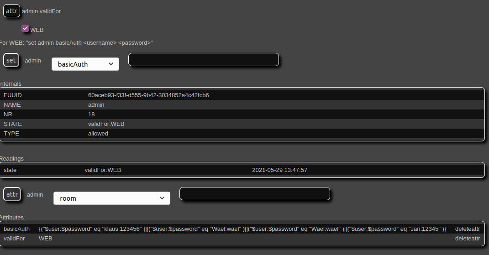
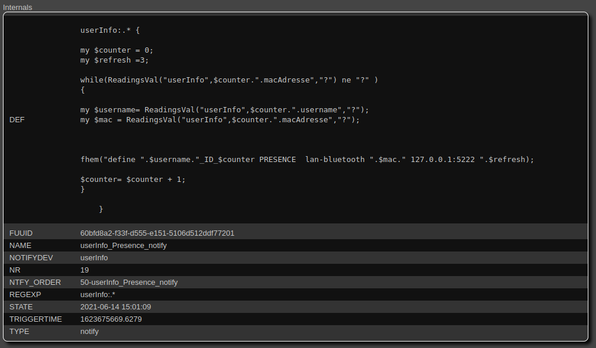
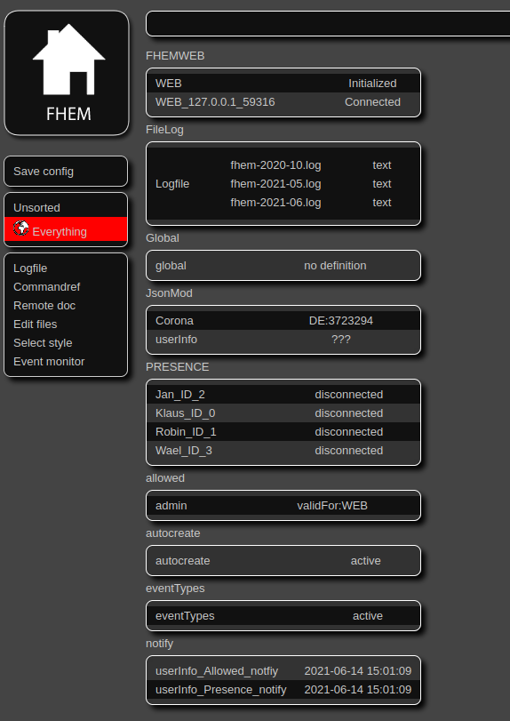
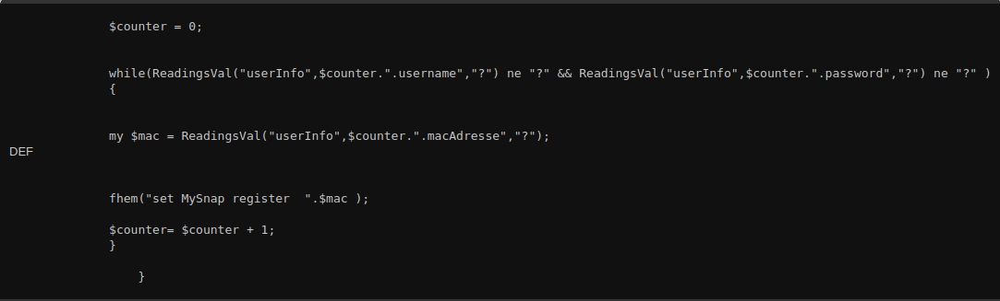

# Teamprojekt_Pursue Audioevaluierung
## Zu installierende Software
### [Peaqb-fast von akinori-ito](https://github.com/akinori-ito/peaqb-fast)

Für die objektive Audioevaluierung wurde sich für eine Implementation des [PEAQ Verfahrens](https://www.itu.int/rec/R-REC-BS.1387) entschieden. Dabei wurde sich für "peaqb-fast" entschieden. Weitere Implementationen, für die sich nicht entschieden wurden, sind:

* [MATLAB Version von P. Kabal](http://www-mmsp.ece.mcgill.ca/Documents/Software/)
* [Python Version von Matthew Cohen and Stephen Welch](https://github.com/stephencwelch/Perceptual-Coding-In-Python)
* [EAQUAL von A. Lerch](http://www.mp3-tech.org/programmer/sources/eaqual.tgz) 
#### Schritt 1:
Peaqb-fast erfordert einen C Compiler. Unter Ubuntu lässt sich „[gcc](https://gcc.gnu.org/)“, falls noch kein C Compiler vorhanden ist, mit dem folgenden Befehl installieren:

  `$sudo apt install build-essential`

Bestimmte Versionen können mit dem folgenden Befehl installiert werden:

  `$sudo apt install gcc-9`

In der Installationsdatei ist keine explizite Version von „[gcc](https://gcc.gnu.org/)“ vorgegeben. Die Installation wurde mit der Version 9.3.0 getestet und durchgeführt.

#### Schritt 2:
Die Dateien für die in C geschriebene Peaqb-fast Variante des PEAQ-Verfahrens müssen von der [Github Seite von „akinori-ito“](https://github.com/akinori-ito/peaqb-fast) heruntergeladen werden. Die Dateien können entweder mit der vorhandenen Archivverwaltung oder mit dem „unzip“ Befehl entpackt werden.

`$unzip peaqb-master-fast.zip`

#### Schritt 3:
Durch das Entpacken der Dateien steht ein neuer Ordner zur Verfügung: „peaqb-fast-master“. In diesem Ordner muss die „configure“ Datei ausgeführt werden.

`$./configure`

Bei der configure Datei handelt es sich um eine von dem Werkzeug „Autoconf“ erzeugte Datei. Autoconf erzeugt Shell-Skripte zur automatischen Konfiguration von Software-Quellcode-Paketen. Diese Skripte können die Pakete an verschiedene auf Unix basierende Systeme anpassen, ohne dass der Benutzer manuell eingreifen muss. Die Skripte fragen das System nach Umgebungseinstellungen und der Plattformarchitektur und speichern diese gesammelten Informationen in einer Datei, um auf Basis der Ergebnisse ein „Makefile“ zur erstellen.

#### Schritt 4:
Mit dem make Werkzeug werden aus dem Quellcode in dem Makefile Binärdateien kompiliert und erstellt. Diese Binärdateien werden anschließend mit „make install“ in das im Makefile angegebene Verzeichnis abgelegt und für den Nutzer zugänglich gemacht.

`$sudo make`

`$sudo make install`

#### Schritt 5:
Das fertige Programm wird im Verzeichnis „/usr/local/bin“ eingerichtet. Falls dies nicht der Fall sein sollte kann die Datei mit dem Befehl „whereis“ gesucht werden.

`$whereis peaqb`

### [PulseAudio](https://www.freedesktop.org/wiki/Software/PulseAudio/)

PulseAudio ist ein Sound-Server, der als Vermittler zwischen Anwendungen und Hardware-Geräten eines Linux Systems läuft, beispielsweise mit [ALSA](https://wiki.ubuntuusers.de/ALSA/). Dieser Sound-Server ermöglich das direkte Aufnehmen von Audiosignalen von den Audioausgabegeräten des Systems wie die Lautsprecher.

#### Schritt 1:
PulseAudio kann auf den meisten Unix Systemen mit dem folgendem Befehl installiert werden:

`$sudo apt-get install pulseaudio`

Für Systeme wie Debian stehen [optionale Pakete](https://wiki.ubuntuusers.de/PulseAudio/) zur Verfügung.

#### Schritt 2:

PulseAudio muss nach der Installation mit folgendem Befehl gestartet werden:

`$pulseaudio -D`
# Teamprojekt_Pursue Audiostreaming-Control
## Modul PresConnect2Snap
### Einleitung
„PresConnect2Snap“ ist ein Vermittlungsmodul zwischen „PRESENCE“ und „SnapControl“. 
Das Ziel ist die benötigten Parameter von „PRESENCE“ zu erhalten und an „SnapControl“ weiterzuleiten. 
Der erster ist ein Modul von FEHM und der anderer ist ein selbst geschriebenes Modul. 
Genaue Details von beide Modulen stehen in die jeweilige Datei PRESENCE und SnapControl zur Verfügung.

### Konfiguration
Bevor die Konfiguration durchgeführt wird, muss ein Bluetooth-fähiges Gerät erst unter „PRESENCE“ definiert werden.
Weiterhin muss die Einrichtung von „SnapControl“ auch anfertigt werden. Dann können die folgenden Schritte durchgeführt werden.
#### Schritt 1: [99_PreConnect2Snap.pm](https://wiki.fhem.de/wiki/99_myUtils_anlegen) erstellen
An linkes Menü „Edit Files“ in FHEMWEB anklicken und „myUtilsTemplate.pm“ auswählen. Der kopierte Code aus der Github-Seite im unten Textfeld einfügen, danach der Dateiname „99_PreConnect2Snap.pm“ für die Programmdatei eintragen und „save as“ anklicken.

**Anmerkung:** Wenn ein anderer Dateiname angegeben wird, muss der Name Initialize-Routine entsprechend angepasst werden.

#### Schritt 2: das definierte Gerät unter dem Modul definieren
Im Eingabefeld in FHEMWEB sollte der define-Befehl wie folgendes eingegeben werden:

`define <deviceName> PresConnect2Snap <PRESENCE-deviceName> <SnapControl-deviceName>`

Falls die Programmdatei vom Schritt 1 und anderen Geräte in FHEM vorhandenen sind, 
dann wird nach der Eingabe des Befehles ein neues Gerät, dessen Type „PresConnect2Snap“ ist, 
erzeugt (siehe die Abbildung 1). Sonst werden die entsprechenden Fehlermeldungen in FHEMWEB angezeigt.

#### Schritt 3: Beim „PRESENCE“-Gerät Attribut [„event-on-change-reading“](https://wiki.fhem.de/wiki/Event-on-change-reading) einrichten
Um nur die Wertänderung des Raums zu erhalten, muss ein Attribut **event-on-change-reading** beim PRESENCE-Gerät hinzugefügt. 
Sonst wird FHEM bei jeder Wertänderung von „PRESENCE“ eine Meldung liefern. 
„Pres2ConnectSnap“ würde dann auf jede Wertänderung reagieren, was nicht erwünscht wird. 
Jedoch mithilfe des Attributs kann nun die Wertänderung gefiltert werden. 
Das Attribut **event-on-change-reading** kann direkt in FHEMWEB gesetzt. 
Wie in der Abbildung 2 gezeigt wird, muss der Wert für das Attribut **event-on-change-reading** als "room" gesetzt werden.

Nach der Einstellung wird das Attribut sofort in FHEMWEB gesehen.

# Teamprojekt_Pursue Nutzerverwaltung
## Nutzerverwaltung Architektur

## Implementierung der JSON-Nutzerverwaltung

In diesem Abschnitt wird die Implementierungsphase der Nutzerverwaltung mit JSONMod dargestellt:

#### Schritt 1: Einlesen einer JSON-Datei in FHEM-Oberfläche

Um eine JSON-Datei in der Oberfläche von FHEM zum Lesen verwenden zu können, liest man die enthaltenen Informationen mit JSONMod. Der folgende Code wird einen JsonMod definieren. Dabei ist der Name der Gerätename und ULR kann als Datei und http- und https-Link angegeben werden:
 
`define userInfo JsonMod file://home/pursue/nutzerverwaltung.json`

#### Schritt 2 : CRON intervallen Setzen

Die JSON-Datei kann dabei mittels „CRON“ in bestimmten, vorher festgelegten Intervallen abgerufen werden. 
Die „Cron-Syntax“ wird hier verwendet, um die JSON-Datei alle 15 Minuten zu aktualisieren.

#### Schritt 3: JSON Elemente lesen

Im dritten Schritt wird die JSON-Datei mit Hilfe der Attribute readingList gelesen. 
Darüber hinaus werden die Informationen mithilfe der Complete-Method des readingList aus der Dateiquelle extrahiert und in FHEM verwendbar gemacht.

## Übertragen der Readings aus JSONMod in Allowed

Für den automatischen Zugriffsschutz der FHEM-Oberfläche werden die gelesenen Informationen aus dem "JSONMod" mit Hilfe eines "Notify" an das "Allowed Modul" übertragen, damit die FHEM-Oberfläche mit Benutzernamen und Passwort gesichert werden kann. 
#### Schritt 1
Für die Implementierung wird ein „Notify“ definiert wie folgt:

`define UserInfo_Allowed_Notify notify a b`

#### Schritt 2
Im "DEF-Editor" des "Notify" wird der folgende Code eingetragen.

#### Schritt 3

Um das Notify zu aktivieren, muss ein Event im verknüpften Modul „userInfo“ erkannt werden. 
Auslöser dafür wäre entweder das manuelle oder das Intervall gesteuerte Lesen der JSON-Datei. 
Das folgende Bild zeigt die automatische Übertragung der Benutzer mit deren Passwörten ins „Allowed“ Modul.

## Übertragen der MAC-Adresse aus JSONMod in Presence

#### Schritt 1

Um die Geräte des Benutzers in der Umgebung zu erkennen, wird eine sepzifische MAC-Adresse durch das "Presence-Modul" abgefragt, um den Benutzer zu identifizieren und Musik in dem Raum in dem sich der Nutzer befindet abzuspielen. Der Überprüfungsvorgang findet alle drei Sekunden statt, wobei die MAC-Adresse in der Umgebung nach Benutzern durchsucht wird. Für diesen Vorgang wird das Modul "Notfiy" benötigt, mit dem die gelesenen Informationen aus dem "JSONMod" an das "Presence-Modul" weitergeleitet werden, um die automatische Generierung des Präsenzmoduls mit Benutzernamen und MAC-Adresse zu erzeugen. Dieser Vorgang wird für alle Benutzer aus „JSONMod“ durchgeführt. Für die Implementierung wird ein „Notify“ definiert wie Folgt:

`Define UserInfo_Presence _Notify notify a b`

#### Schritt 2

Im "DEF-Editor" des "Notify" wird der folgende Code eingetragen.

#### Schritt 3

Nach dem Auslösen des „userInfo_Presence_notify“ werden die folgenden Präsenzmodule mit dem Nutzernamen und ID angelegt. Das Ergebnis ist in folgender Abbildung zu sehen.

## Übertragen der MAC-Adresse aus JSONMod in SnapControl

Nach der Erkennung der MAC-Adresse des Nutzers in der Umgebung wird diese an das „SnapControl“-Modul weitergeleitet, um zu prüfen, ob die angegebene MAC-Adresse für das „Streamen“ von Musik im System zugelassen ist. Für diesen Vorgang wird das Modul "Notify" verwendet, mit dem die aus dem "JSONMod" gelesenen MAC-Adresse an das "SnapControl"-Modul weitergeleitet wird. Die gelesene MAC-Adresse wird über das „Notify“ an das „SnapControl“-Modul übertragem. Dort wird geprüft, ob der Benutzer Autorisiert ist einen Stream abzusetzen.

#### Schritt 1
Für die Implementierung wird ein „Notify“ definiert wie folgt:

`Define UserInfo_Allowed_Notify notify a b`

#### Schritt 2
Im "DEF-Editor" des "Notify" wird der folgende Code eingetragen.

