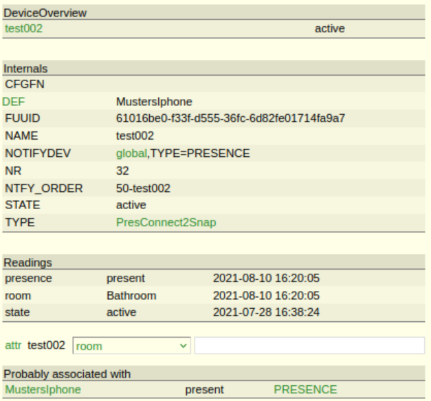
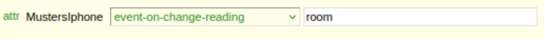
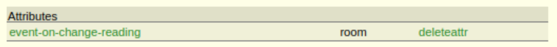

# Teamprojekt_Pursue Audiostreaming-Control
## Modul PresConnect2Snap
### Einleitung
„PresConnect2Snap“ ist ein Vermittlungsmodul zwischen „PRESENCE“ und „SnapControl“. 
Das Ziel ist die benötigten Parameter von „PRESENCE“ zu erhalten und an „SnapControl“ weiterzuleiten. 
Der erster ist ein Modul von FEHM und der anderer ist ein selbst geschriebenes Modul. 
Genaue Details von beide Modulen stehen in die jeweilige Datei PRESENCE und SnapControl zur Verfügung.

### Konfiguration
Bevor die Konfiguration durchgeführt wird, muss ein Bluetooth-fähiges Gerät erst unter „PRESENCE“ definiert werden.
Weiterhin muss die Einrichtung von „SnapControl“ auch anfertigt werden. Dann können die folgenden Schritte durchgeführt werden.
#### Schritt 1: [99_PreConnect2Snap.pm](https://wiki.fhem.de/wiki/99_myUtils_anlegen) erstellen
An linkes Menü „Edit Files“ in FHEMWEB anklicken und „myUtilsTemplate.pm“ auswählen. Der kopierte Code aus der Github-Seite im unten Textfeld einfügen, danach der Dateiname „99_PreConnect2Snap.pm“ für die Programmdatei eintragen und „save as“ anklicken.

**Anmerkung:** Wenn ein anderer Dateiname angegeben wird, muss der Name Initialize-Routine entsprechend angepasst werden.

#### Schritt 2: das definierte Gerät unter dem Modul definieren
Im Eingabefeld in FHEMWEB sollte der define-Befehl wie folgendes eingegeben werden:

`define <deviceName> PresConnect2Snap <PRESENCE-deviceName> <SnapControl-deviceName>`

Falls die Programmdatei vom Schritt 1 und anderen Geräte in FHEM vorhandenen sind, 
dann wird nach der Eingabe des Befehles ein neues Gerät, dessen Type „PresConnect2Snap“ ist, 
erzeugt (siehe die Abbildung 1). Sonst werden die entsprechenden Fehlermeldungen in FHEMWEB angezeigt.

#### Schritt 3: Beim „PRESENCE“-Gerät Attribut [„event-on-change-reading“](https://wiki.fhem.de/wiki/Event-on-change-reading) einrichten
Um nur die Wertänderung des Raums zu erhalten, muss ein Attribut **event-on-change-reading** beim PRESENCE-Gerät hinzugefügt. 
Sonst wird FHEM bei jeder Wertänderung von „PRESENCE“ eine Meldung liefern. 
„Pres2ConnectSnap“ würde dann auf jede Wertänderung reagieren, was nicht erwünscht wird. 
Jedoch mithilfe des Attributs kann nun die Wertänderung gefiltert werden. 
Das Attribut **event-on-change-reading** kann direkt in FHEMWEB gesetzt. 
Wie in der Abbildung 2 gezeigt wird, muss der Wert für das Attribut **event-on-change-reading** als "room" gesetzt werden.

#

Nach der Einstellung wird das Attribut sofort in FHEMWEB gesehen.

