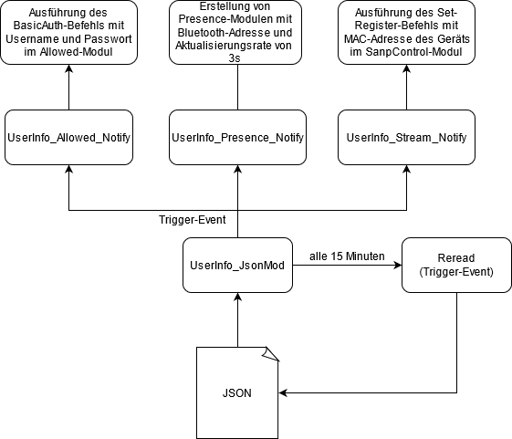
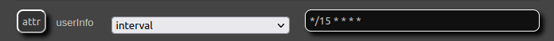
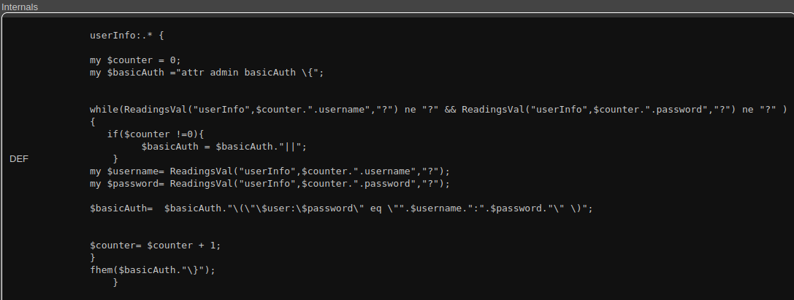
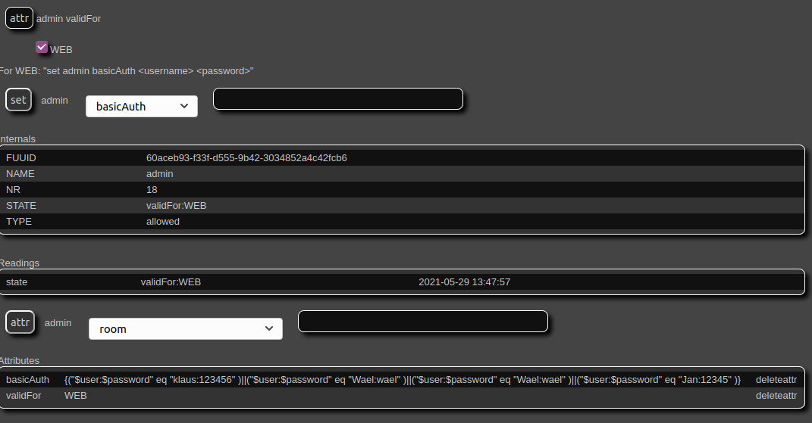
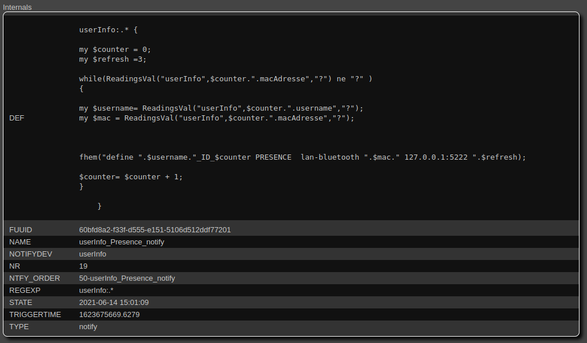
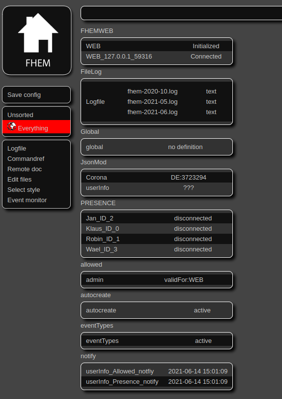
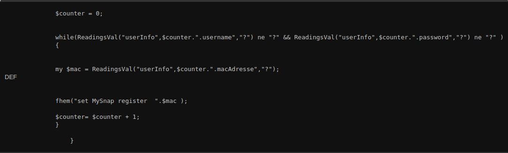

# Teamprojekt_Pursue Nutzerverwaltung
## Nutzerverwaltung Architektur

## Implementierung der JSON-Nutzerverwaltung

In diesem Abschnitt wird die Implementierungsphase der Nutzerverwaltung mit JSONMod dargestellt:

#### Schritt 1: Einlesen einer JSON-Datei in FHEM-Oberfläche

Um eine JSON-Datei in der Oberfläche von FHEM zum Lesen verwenden zu können, liest man die enthaltenen Informationen mit JSONMod. Der folgende Code wird einen JsonMod definieren. Dabei ist der Name der Gerätename und ULR kann als Datei und http- und https-Link angegeben werden:
 
`define userInfo JsonMod file://home/pursue/nutzerverwaltung.json`

#### Schritt 2 : CRON intervallen Setzen

Die JSON-Datei kann dabei mittels „CRON“ in bestimmten, vorher festgelegten Intervallen abgerufen werden. 
Die „Cron-Syntax“ wird hier verwendet, um die JSON-Datei alle 15 Minuten zu aktualisieren.

#### Schritt 3: JSON Elemente lesen

Im dritten Schritt wird die JSON-Datei mit Hilfe der Attribute readingList gelesen. 
Darüber hinaus werden die Informationen mithilfe der Complete-Method des readingList aus der Dateiquelle extrahiert und in FHEM verwendbar gemacht.

## Übertragen der Readings aus JSONMod in Allowed

Für den automatischen Zugriffsschutz der FHEM-Oberfläche werden die gelesenen Informationen aus dem "JSONMod" mit Hilfe eines "Notify" an das "Allowed Modul" übertragen, damit die FHEM-Oberfläche mit Benutzernamen und Passwort gesichert werden kann. 
#### Schritt 1
Für die Implementierung wird ein „Notify“ definiert wie folgt:

`define UserInfo_Allowed_Notify notify a b`

#### Schritt 2
Im "DEF-Editor" des "Notify" wird der folgende Code eingetragen.

#### Schritt 3

Um das Notify zu aktivieren, muss ein Event im verknüpften Modul „userInfo“ erkannt werden. 
Auslöser dafür wäre entweder das manuelle oder das Intervall gesteuerte Lesen der JSON-Datei. 
Das folgende Bild zeigt die automatische Übertragung der Benutzer mit deren Passwörten ins „Allowed“ Modul.

## Übertragen der MAC-Adresse aus JSONMod in Presence

#### Schritt 1

Um die Geräte des Benutzers in der Umgebung zu erkennen, wird eine sepzifische MAC-Adresse durch das "Presence-Modul" abgefragt, um den Benutzer zu identifizieren und Musik in dem Raum in dem sich der Nutzer befindet abzuspielen. Der Überprüfungsvorgang findet alle drei Sekunden statt, wobei die MAC-Adresse in der Umgebung nach Benutzern durchsucht wird. Für diesen Vorgang wird das Modul "Notfiy" benötigt, mit dem die gelesenen Informationen aus dem "JSONMod" an das "Presence-Modul" weitergeleitet werden, um die automatische Generierung des Präsenzmoduls mit Benutzernamen und MAC-Adresse zu erzeugen. Dieser Vorgang wird für alle Benutzer aus „JSONMod“ durchgeführt. Für die Implementierung wird ein „Notify“ definiert wie Folgt:

`Define UserInfo_Presence _Notify notify a b`

#### Schritt 2

Im "DEF-Editor" des "Notify" wird der folgende Code eingetragen.

#### Schritt 3

Nach dem Auslösen des „userInfo_Presence_notify“ werden die folgenden Präsenzmodule mit dem Nutzernamen und ID angelegt. Das Ergebnis ist in folgender Abbildung zu sehen.

## Übertragen der MAC-Adresse aus JSONMod in SnapControl

Nach der Erkennung der MAC-Adresse des Nutzers in der Umgebung wird diese an das „SnapControl“-Modul weitergeleitet, um zu prüfen, ob die angegebene MAC-Adresse für das „Streamen“ von Musik im System zugelassen ist. Für diesen Vorgang wird das Modul "Notify" verwendet, mit dem die aus dem "JSONMod" gelesenen MAC-Adresse an das "SnapControl"-Modul weitergeleitet wird. Die gelesene MAC-Adresse wird über das „Notify“ an das „SnapControl“-Modul übertragem. Dort wird geprüft, ob der Benutzer Autorisiert ist einen Stream abzusetzen.

#### Schritt 1
Für die Implementierung wird ein „Notify“ definiert wie folgt:

`Define UserInfo_Allowed_Notify notify a b`

#### Schritt 2
Im "DEF-Editor" des "Notify" wird der folgende Code eingetragen.

